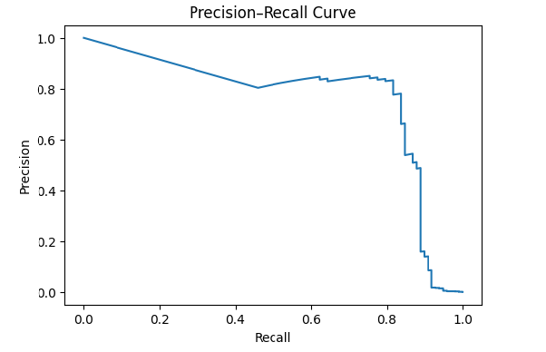
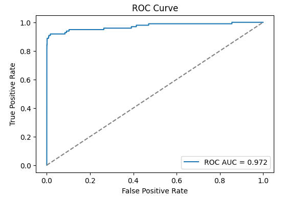
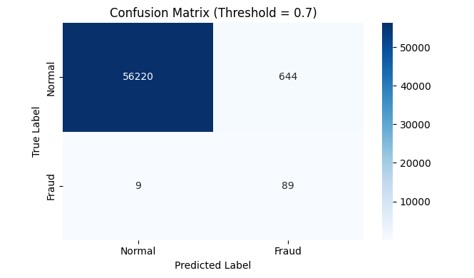

# 💳 Fraud Detection — Machine Learning Pipeline

## 📌 Problem Overview
This project addresses a **highly imbalanced credit card fraud detection** problem,
where the objective is to identify fraudulent transactions while minimizing false
alerts that negatively impact customer experience.

Fraud detection is a **cost-sensitive classification problem**, where false negatives
(missed fraud) typically incur higher cost than false positives.

---

## 📊 Dataset
The dataset contains anonymized credit card transactions:
- Features **V1–V28** are **PCA-transformed**
- **Time** and **Amount** represent transaction time and value
- Target variable **Class**:
  - `0` → Normal transaction  
  - `1` → Fraudulent transaction  

Fraud cases represent approximately **0.17%** of the dataset.

---

## 🗂️ Project Structure

fraud-detection-ml/
├── notebooks/
│   ├── 01_eda.ipynb
│   ├── 02_preprocessing.ipynb
│   ├── 03_modeling.ipynb
│   └── 04_evaluation.ipynb
├── images/
│   ├── pr_curve.png
│   ├── roc_curve.png
│   └── confusion_matrix.png
├── requirements.txt
├── .gitignore
└── README.md

## 🔁 Machine Learning Pipeline

Raw Dataset (creditcard.csv)
        ↓
01_eda — Exploratory Data Analysis
        ↓
02_preprocessing
  • Stratified train/test split
  • Feature scaling (Time, Amount)
  • Artifact persistence
        ↓
03_modeling
  • Logistic Regression (baseline)
  • Probability predictions
        ↓
04_evaluation
  • ROC-AUC & PR-AUC
  • Threshold tuning
  • Business-aware evaluation

## ⚙️ Key Modeling Decisions
- Severe class imbalance handled using **class-weighted training**
- **Probability-based metrics** prioritized over accuracy
- **Threshold tuning** aligned with business risk trade-offs
- Preprocessing and modeling stages are **fully decoupled**
  to resemble real-world ML pipelines

## 📈 Results Summary
- **ROC-AUC ≈ 0.97**
- High recall for fraudulent transactions
- False positives significantly reduced via threshold tuning

## 📊 Evaluation Visuals

### Precision–Recall Curve

### ROC Curve

### Final Confusion Matrix (Threshold = 0.7)

## 🚀 Next Steps
- Compare baseline with tree-based models (Random Forest, XGBoost, LightGBM)
- Add explicit cost-based evaluation
- Deploy the model using a REST API (FastAPI)

## 🛠️ Requirements

    pip install -r requirements.txt

## 👤 Author
**Mohamed Saad**
