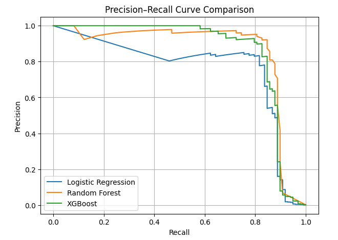

# 💳 Fraud Detection — Machine Learning Pipeline

## 📌 Project Overview
This project tackles a **highly imbalanced credit card fraud detection** problem,
where the goal is to maximize fraud detection while controlling false positive alerts
that negatively impact customer experience.

Fraud detection is treated as a **cost-sensitive classification problem**, where
false negatives (missed fraud) typically incur higher cost than false positives.


## 📊 Dataset
The dataset contains anonymized credit card transactions:
- Features **V1–V28** are **PCA-transformed**
- **Time** and **Amount** represent transaction time and value
- Target variable **Class**:
  - `0` → Normal transaction  
  - `1` → Fraudulent transaction  

Fraud cases represent approximately **0.17%** of the dataset, making
traditional accuracy-based evaluation misleading.

> The dataset is excluded from version control and should be placed locally under the `data/` directory.

> Dataset source: Kaggle — Credit Card Fraud Dataset.

## 🗂️ Project Structure
> Trained models and preprocessing artifacts are persisted locally for
> reproducibility but are excluded from version control.

```text
fraud-detection-ml/
├── notebooks/
│   ├── 01_eda.ipynb
│   ├── 02_preprocessing.ipynb
│   ├── 03_modeling.ipynb
│   ├── 04_evaluation.ipynb
│   └── 05_model_comparison.ipynb
│
├── artifacts/
│
├── models/
│
├── images/
│   └── pr_curve_comparison.png
│
├── requirements.txt
└── README.md
```
## 🔁 Machine Learning Pipeline

```text
Raw Dataset (creditcard.csv)
        ↓
01_eda — Exploratory Data Analysis
        ↓
02_preprocessing
  • Stratified train/test split
  • Feature scaling (Time, Amount)
  • Artifact persistence
        ↓
03_modeling
  • Logistic Regression (baseline)
        ↓
04_evaluation
  • PR-AUC / ROC-AUC
  • Threshold tuning
        ↓
05_model_comparison
  • Logistic Regression
  • Random Forest
  • XGBoost
  • Business-aware model selection
```

## ⚙️ Modeling Strategy
- Severe class imbalance handled using **class-weighted training**
- **PR-AUC** prioritized over accuracy due to extreme imbalance
- **Probability-based evaluation** used instead of hard predictions
- **Threshold tuning** aligned with operational and business risk
- Preprocessing, modeling, and evaluation are fully **decoupled**
  to resemble real-world ML pipelines
- Different probability distributions across models required
  **model-specific threshold selection**


## 📊 Final Model Comparison

| Model | PR-AUC | Threshold | Precision | Recall | False Positives |
|------|--------|-----------|-----------|--------|-----------------|
| Logistic Regression | 0.716 | 0.70 | 0.12 | 0.91 | 644 |
| Random Forest | 0.854 | 0.35 | 0.94 | 0.81 | 5 |
| **XGBoost** | **0.861** | **0.50** | **0.67** | **0.86** | **41** |


## ✅ Final Model Selection
- Logistic Regression achieved high fraud recall but generated an excessive
  number of false positive alerts.
- Random Forest minimized false positives but missed a larger portion of fraud.
- **XGBoost achieved the best overall balance**, combining:
  - Highest ranking performance (PR-AUC)
  - Strong fraud recall
  - Substantial reduction in false positives

➡️ **XGBoost was selected as the preferred production candidate under a
moderate risk tolerance setting.**

> **Key takeaway:** Model selection in fraud detection is driven by business
> trade-offs rather than metric maximization.

## 📈 Precision–Recall Curve Comparison



## 🛠️ Tech Stack
- Python
- scikit-learn
- XGBoost
- NumPy / Pandas
- Matplotlib


## 👤 Author
**Mohamed Saad**
