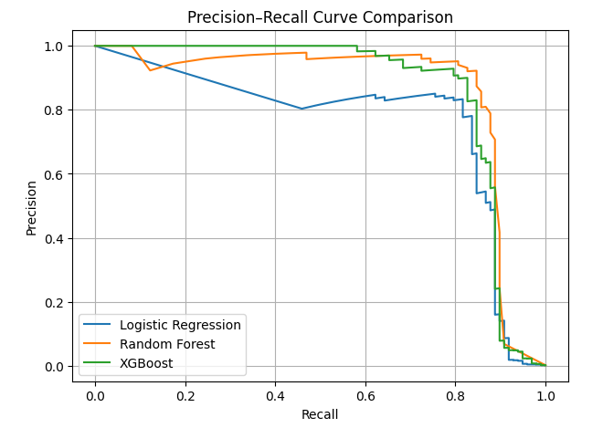
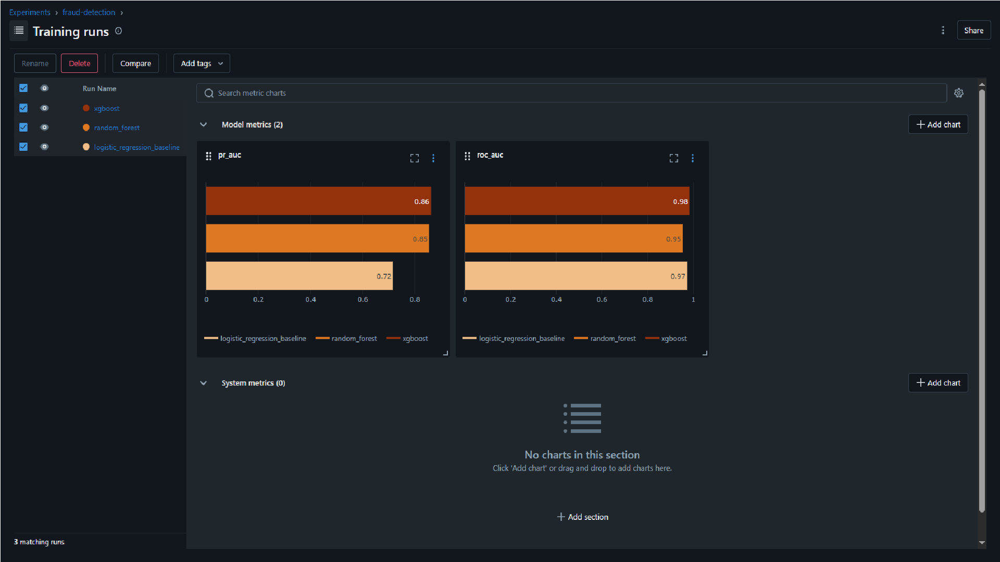

# Fraud Detection — End-to-End ML Pipeline

   

A production-oriented machine learning pipeline for credit card fraud detection on a highly imbalanced dataset (~0.17% fraud rate). The goal is to maximize fraud recall while controlling false positive alerts — evaluated using business cost analysis, not just accuracy.

---

## Pipeline


---

## Results

| Model | PR-AUC | ROC-AUC | Threshold | Recall | False Positives |
|-------|--------|---------|-----------|--------|-----------------|
| Logistic Regression | 0.716 | 0.972 | 0.70 | 0.91 | 644 |
| Random Forest | 0.854 | 0.953 | 0.35 | 0.81 | 5 |
| **XGBoost** | **0.861** | **0.984** | **0.35** | **0.86** | **41** |

XGBoost was selected as the final model based on expected financial loss analysis, not metric maximization alone.

---

## Precision–Recall Curve Comparison



XGBoost and Random Forest significantly outperform Logistic Regression on the fraud class. XGBoost achieves the best overall PR-AUC while maintaining stronger recall at higher precision thresholds.

---

## Experiment Tracking (MLflow)

All training runs logged with MLflow — parameters, metrics, and model artifacts tracked across all 3 models.



---

## Key Engineering Decisions

**Class imbalance** — handled via class-weighted training, not resampling, to preserve the original data distribution and avoid synthetic sample artifacts.

**Evaluation metric** — PR-AUC prioritized over accuracy. With a 0.17% fraud rate, accuracy is misleading — a model predicting all transactions as normal achieves 99.8% accuracy while detecting zero fraud.

**Threshold tuning** — each model has its own operating threshold selected by balancing precision, recall, and business cost. Defaulting to 0.5 is inappropriate for imbalanced problems.

**Cost-based selection** — models compared by expected financial loss: false negatives (missed fraud) carry a cost of $500, false positives (false alerts) carry a cost of $5. XGBoost achieved the lowest total expected loss across all evaluated thresholds.

**Decoupled pipeline** — preprocessing, modeling, and evaluation are fully separated. Each notebook saves and loads artifacts explicitly, matching real production ML patterns where stages run independently.

**Config-driven inference** — the decision threshold is externalized to `model_config.json`. Business risk tolerance can be adjusted without modifying inference code, enabling safer policy updates.

---

## Project Structure

```
fraud-detection-ml/
├── data/                    (local only — excluded from version control)
├── notebooks/
│   ├── 01_eda.ipynb
│   ├── 02_preprocessing.ipynb
│   ├── 03_modeling.ipynb
│   ├── 04_evaluation.ipynb
│   ├── 05_model_comparison.ipynb
│   ├── 06_cost_evaluation.ipynb
│   └── 07_inference.ipynb
├── models/                  (local only — excluded from version control)
├── artifacts/               (local only — excluded from version control)
├── assets/
│   ├── fraud_detection_ml_pipeline.png
│   ├── pr_curve_comparison.png
│   └── mlflow_comparison.png
├── requirements.txt
└── README.md
```

---

## Inference Module

The inference module (`07_inference.ipynb`) demonstrates how the trained model would operate in a real production system:

- Loads trained model and scaler from persisted artifacts
- Enforces strict feature schema matching training-time inputs
- Handles missing features defensively with zero-fill defaults
- Loads decision threshold from external config file — not hard-coded
- Implemented as pure Python functions, ready to wrap with FastAPI or Flask without changing core business logic

---

## Dataset

Anonymized credit card transactions. Features V1–V28 are PCA-transformed by the dataset provider. Time and Amount are the only raw features and are scaled during preprocessing.

> Source: [Kaggle — Credit Card Fraud Detection](https://www.kaggle.com/datasets/mlg-ulb/creditcardfraud)
> Place `creditcard.csv` under `data/` locally.

---

## Tech Stack

Python · XGBoost · Scikit-learn · MLflow · Pandas · NumPy · Matplotlib

---

## Author

**Mohamed Saad** — [GitHub](https://github.com/msaad-dot) · [LinkedIn](https://www.linkedin.com/in/muhammed-saad74/)
